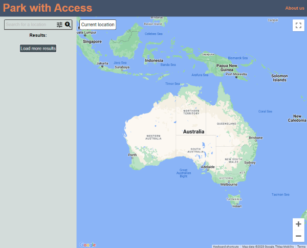

# Park with Access

## Description

Park with Access App was born out of a collective desire to address the challenges faced by individuals when searching for suitable parking spots. Our motivation stems from a genuine commitment to enhancing the mobility and convenience of every user, ensuring that everyone can access parking facilities tailored to their needs.

The Park with Access App is not just a project; it's a commitment to making urban mobility more accessible and enjoyable for everyone.

Click on the link to access our live site: https://honguyen00.github.io/map-parking/

## Installation 
N/A

## Usage
Landing page: 

     

    - Search for a designated location
    Open the web application and input your desired location in the search bar. We have implemented autocomplete feature to make searching for location more intuitive. On search button click, a marker will appear on the map, marking the searched location.

    - Show current location
    On "Current location" button click, users will be prompted by browser to allow access to their current location. If allow, their current location will be display on the map.

    - Filter Results
    Utilize the provided filters to narrow down parking options based on specific criteria.

    - Search for parking around
    On double clicking on the searched location or current location and based on the chosen filter options, our application will carry out a search query to find and display parking spaces around that location
   
    - Display Detailed Information
    Click on a specific parking spot to access a wealth of information, including address, street view, rating, and other users' feedback about accessibility.

    - View Search History
    After finishing your search, searched location will be stored and can be accessed through a search history menu. Clicking on a search history will take you to the search location again.

## Credits

Please see the link to all our collaborators GitHub profiles:

Milo: https://github.com/miloyang 
Felix: https://github.com/honguyen00 
Marion: https://github.com/MFMcNolt

## Future features
- Adding more filter options to match more specific needs (Free, Paid, Indoor, Outdoor, Electric charging station etc ...)
- Users can create and share custom marker on any parking spaces or facilities with photos and details
